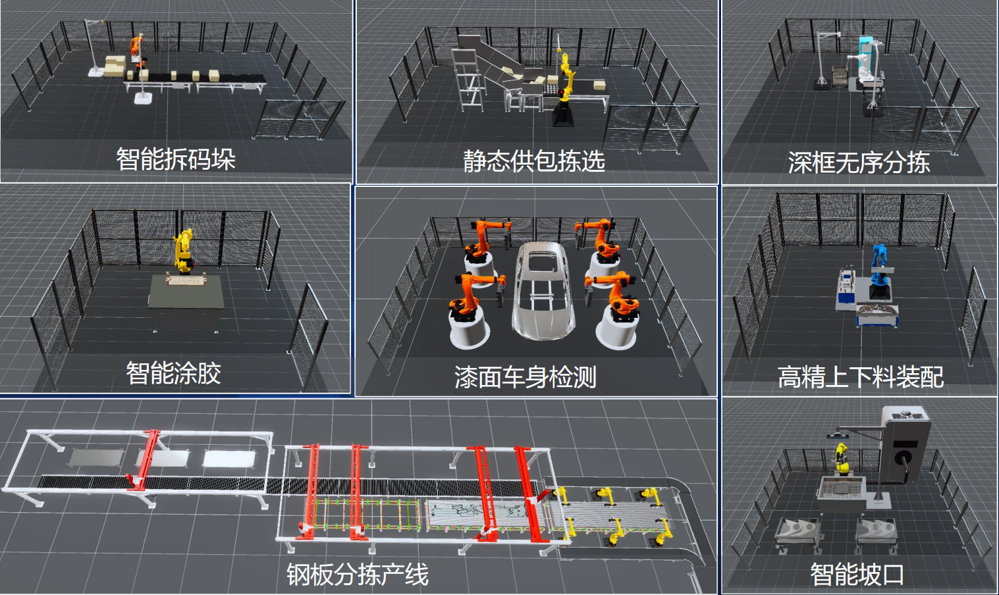
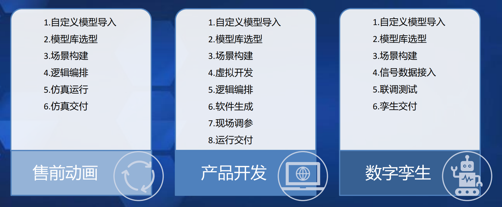
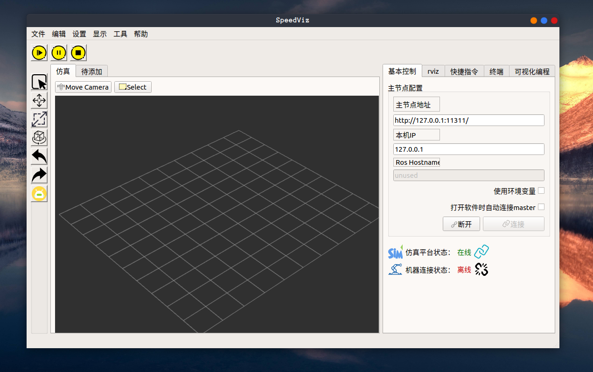
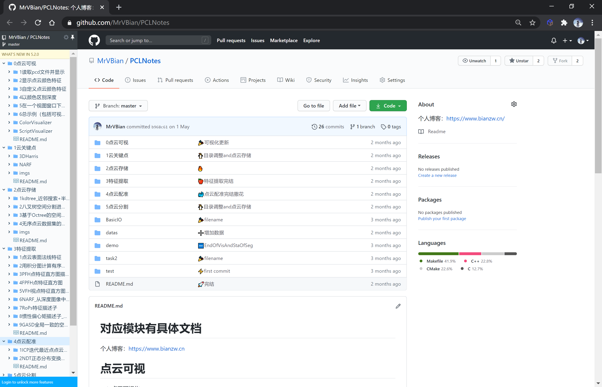

# 工作成果 - 介绍

卞振伟，zhenweibian.sh@gmail.com

中国，上海

摘　要：
 

你好！我叫卞振伟，我的兴趣集中在机器人、仿真、软件工程和云原生这些领域。特别是，我对机器人仿真的完整生命周期充满了热情——从设计、通信、仿真、训练到最终的决策，每一个环节都让我着迷。我相信卧薪尝胆终有回报，虽然期间有很多的不容易，但是我都没有放弃过，学了这一行，就深深的喜欢上它。我喜欢一句话“冥冥中该来则来，无处可逃”。我喜欢上了坐在电脑前敲代码，喜欢跟一堆程序员聊天。这辈子，我也逃不出去了，深深的陷了进来......

关键词：
 

机器人；仿真；软件工程；云原生；

# Work results - Introduction

Zhenwei Bian, zhenweibian.sh@gmail.com

Shanghai, China

<b>Abstract: </b>
 

Hi there! My name is Bian Zhenwei. My interests are in the fields of robotics, simulation, software engineering, and cluster management. In particular, I am passionate about the complete life cycle of robot simulation - from design, communication, modeling, training to final decision-making, every link fascinates me. I believe that hard work will eventually pay off. Although there were many difficulties during the period, I never gave up. After learning this line, I fell in love with it deeply. I like the saying "What is destined to come will come, and there is no escape." I like sitting in front of the computer and typing code, and I like chatting with a bunch of programmers. In this life, I can't escape, and I am deeply trapped in it...

<b>Key Words: </b>
 

Robotics; Simulation; Software Engineering; Cloud Native;

**目录结构**：

[TOC]

#  工作成果

## 2024-5 至今 XX公司

### Isaac仿真平台搭建及机器人训练

**开发角色：**个人
**业务目标：**运动学、动力学、虚拟视觉仿真

<video src="./videos/20241118Isaac%E5%B1%95%E7%A4%BA.mp4" style="width: 100%; height: 100%;" controls="controls"></video>

### ROS2上位机软件

**开发角色：**个人
**业务目标：**上位机软件，URDF模型制作

<video src="https://gitlab.com/MrVBian/Introduction/-/raw/master/20241009%E4%B8%8A%E4%BD%8D%E6%9C%BA%E5%8A%9F%E8%83%BD%E5%B1%95%E7%A4%BA.mp4" style="width: 100%; height: 100%;" controls="controls"></video>

### 机器人数据存储及可视化

**开发角色：**个人
**业务目标：**基于时序数据库(InfluxDB)、ROS2、Grafana，实现机器人数据数采存储及数据可视化

<video src="https://gitlab.com/MrVBian/Introduction/-/raw/94cc1200a6bda16db76ef5575080ca0795c0acec/20241010%E6%97%B6%E5%BA%8F%E6%95%B0%E9%87%87.mp4" style="width: 100%; height: 100%;" controls="controls"></video>

### 机器人遥操WebGL

**开发角色：**个人
**业务目标：**ROS2、WebSocket、Unity，辅助机器人遥操

<video src="https://gitlab.com/MrVBian/Introduction/-/raw/94cc1200a6bda16db76ef5575080ca0795c0acec/20241010WebGL%E5%8A%9F%E8%83%BD%E5%B1%95%E7%A4%BA.mp4" style="width: 100%; height: 100%;" controls="controls"></video>

### Gazebo仿真

**开发角色：**个人
**业务目标：**在gazebo中模拟机器人、2D相机、3D相机、激光雷达，以供在仿真中训练算法

<video src="https://gitlab.com/MrVBian/Introduction/-/raw/master/20240726Gazebo(lidar%20rgb%E5%92%8Cdepth%E7%9B%B8%E6%9C%BA).mp4" style="width: 100%; height: 100%;" controls="controls"></video>

## 2020-12 至 2024-4 视比特机器人有限公司

### 仿真软件开发

介绍：从零到一开发数字孪生平台。数字孪生平台拥有丰富的组件模型库以及模型自动装配等功能，具备灵活的场景构建能力，平台内置物理引擎，能够高效模拟重力等物理属性，同时自带2D/3D图像生成、工艺仿真、物流仿真、虚拟调试、数字孪生功能，用于智能化工厂产线建设、程序开发、虚拟调试和数字孪生运营等功能。

#### 离散事件仿真软件

**开发角色：**九人团队主管
**主要工作：**离散仿真器开发、节点设计
**业务目标：推算年产量、优化节拍、优化布局**

<video src="https://gitlab.com/MrVBian/Introduction/-/raw/94cc1200a6bda16db76ef5575080ca0795c0acec/20240314%E8%8A%82%E6%8B%8D%E4%BB%BF%E7%9C%9F.mp4" style="width: 100%; height: 100%;" controls muted></video>

#### 焊接虚拟调试工艺包

**开发角色：**九人团队主管
**主要工作：**焊缝提取、机器人点位表、离线编程(fanuc)
**业务目标：**焊缝提取、机器人免示教、可视化编程

<video src="https://gitlab.com/MrVBian/Introduction/-/raw/c99860d5c1a69aa525cea4e0aabf41c44f3d0b24/20231215%E7%84%8A%E6%8E%A5%E7%B4%A0%E6%9D%901.mp4" style="width: 100%; height: 100%;" controls="controls"></video>

#### 上下料单栈虚拟研发

**开发角色：**九人团队主管
**主要工作：**相机标定、虚拟视觉仿真、行为树后端
**业务目标：**虚拟视觉2D/3D，相机标定、行为树编程
<video src="https://gitlab.com/MrVBian/Introduction/-/raw/master/20220531%E4%B8%8A%E4%B8%8B%E6%96%99%E8%99%9A%E6%8B%9F%E8%B0%83%E8%AF%95.mp4" style="width: 100%; height: 100%;" controls="controls"></video>

#### 中联长沙分拣线虚拟调试

**开发角色：**九人团队主管
**主要工作：**虚拟视觉、传感器仿真、工业设备仿真(末端工具)
**业务目标：**各部门联调、虚拟视觉、工业设备仿真
<video src="https://gitlab.com/MrVBian/Introduction/-/raw/master/20220609%E4%B8%AD%E8%81%94%E9%95%BF%E6%B2%99.mp4" style="width: 100%; height: 100%;" controls="controls"></video>

#### 仿真软件内场景构建

**开发角色：**九人团队主管
**主要工作：**对齐、装配、参数化模型工具
**业务目标：**通过一系列工具辅助用户快速完成仿真场景的构建。包括例如：测距、捕捉、对齐、装配、阵列、角度捕捉等工具，以及参数化模型、机器人资产、工业设备资产等。
<video src="https://gitlab.com/MrVBian/Introduction/-/raw/20d5c9c2deab9a5bfd5831821eecb89f99ad8aa2/20230107%E7%94%A8%E6%88%B7%E6%9E%84%E5%BB%BA%E5%9C%BA%E6%99%AF_%E4%B8%80%E5%88%86%E9%92%9F%E7%89%88.mp4" style="width: 100%; height: 100%;" controls="controls"></video>

#### 上海展厅虚实同步 5x

**开发角色：**九人团队主管
**主要工作：**分布式数采、虚实同步、模型压缩
**业务工作：**构建真实展厅科幻画风的虚实1:1同步，展示数字化展厅。
<video src="https://gitlab.com/MrVBian/Introduction/-/raw/master/20220801%E4%B8%8A%E6%B5%B7%E5%B1%95%E5%8E%85_5x.mp4" style="width: 100%; height: 100%;" controls="controls"></video>

#### 机器人编程(流程图编程)

**开发人员：**九人团队主管
**主要工作：**流程图后端开发
**业务目标：**可视化编程、机器人免示教

<video src="https://gitlab.com/MrVBian/Introduction/-/raw/c99860d5c1a69aa525cea4e0aabf41c44f3d0b24/2023062318%E6%9C%BA%E5%99%A8%E4%BA%BA%E7%BC%96%E7%A8%8B.mp4" style="width: 100%; height: 100%;" controls="controls"></video>

### 服务器算力集群搭建

**开发人员：**三人团队组长
**主要工作：**开源平台调研、集群构建、运维开发、Jenkins编写、容器制作
**业务目标：**
- 将服务器搭建成集群：通过统一web入口分配算力，维护高可用的服务器，避免资源浪费，有效管理服务器的资源分配
- 统一账号管理：通过单一账号登录多平台，简化账号管理
- DevOps：搭建流水线，编写Jenkins流水线，实现harbor和sonarqube代码质量检查

### 借助Vrep进行Sim2real码垛仿真

**开发人员：**个人
**业务目标：**结合强化学习做出的决策，利用Vrep实现码垛仿真

### ROS1 Rviz 插件编写

**开发人员：**个人
**业务目标：**应公司内部需要开发一款基于ROS的仿真软件，专为Linux环境设计。该软件以Rviz为基础，旨在简化UI交互，提高用户友好性和易用性。通过ROS作为开发框架，我们能够充分利用其功能和工具库，实现强大的仿真功能，并与其他ROS节点和包进行无缝通信，实现与机器人系统的紧密集成。

### ROS1 flow based programming

**开发人员：**个人
**业务目标：**为了满足公司内部需求，我们将基于ROS开发一款基于流程图的图像化编程工具。该工具旨在帮助用户以图像化的方式对ROS进行编程控制，通过流程图的形式可视化编程逻辑。该工具将提供多个预定义的节点，每个节点代表了ROS中的不同功能和操作，根据需求选择适当的节点，并在图形界面中定义它们之间的连接关系。

### PCL点云库

[https://github.com/MrVBian/PCLNotes](https://github.com/MrVBian/PCLNotes "https://github.com/MrVBian/PCLNotes")

## 在校成果

### 论文

- Driving Assistance System Based on Deep Learning and Traditional Vision  Zhenwei Bian, Tao Yu, Xin Zhang, Xiaoyan GongYe, CSA2020. 
- Learning 6D Pose of Texture-less Objects via Multi-scale Dense Relation  Junwen Huang, Zhenwei Bian, Yifei Shi, Xin Xu, Hongjia Zhang, Chenggang Xie，IVPAI2020. 
- Unsupervised Part-wise 3D Shape Reconstruction from Single-View RGB Images  Chengjie Niu, Yang Yu, Zhenwei Bian, Jun Li, Kai Xu, Computer Graphics Forum. 

### 荣誉成绩

- 山东省高校大学生人工智能大赛特等奖[2019.10]
- 第七届发现杯互联网应用开发与设计华东赛区一等奖[2020.05]
- 国际大学生程序设计竞赛2019年度秦皇岛、银川、西安全国总决赛优秀奖[2019]
- 蓝桥杯C/C++组国家三等奖，山东省一等奖[2019]
- 成立程序竞赛协会并担任会长[2018-2019]
- 计算机技术与软件专业技术资格中级软件设计师证[2018上半年]
- 一等奖学金(Top5%两次)  三好学生(Top5%两次)  优秀团员(Top15%)

- **个人博客**

**
~~[https://www.bianzw.cn/](https://www.bianzw.cn/ "https://www.bianzw.cn/")（截止2020.4.1共237篇博文，已下线）~~
**

### 基于计算机视觉的辅助驾驶系统

**独立完成**

**实现大体流程**：

- 1. 前期：
     1.1 数据采集**确保数据分布全部来自同一分布**（这里是行车记录仪的录像）
     1.2 **数据增强**平移、旋转、翻转、椒盐噪声（Salt-and-pepper Noise）、高斯噪声（Gaussian Noise）等，由于涉及红绿灯颜色识别，不可采用改变颜色数值方式的数据增强策略。
     1.3 **划分验证机-训练集-测试集**
     1.4 **评估人类表现水平**，水平取参与评估人每个人的识别率、专家每个人识别率和专家小组识别率的最高值。
- 2. 中期：
     2.1 查阅文献尽可能**选取几个较优网络或者做迁移学习**，目的是**尽可能提高效率和效果**，加快收敛。
     2.2 **如果可避免偏差大于训练集与验证集之间错误率的差值，专注于减小偏差；反之，就应该专注于减小方差。**
     2.3 **减少偏差：围绕增加隐藏层神经元个数和加深神经网络等方式做优化。减少方差：围绕获取更多训练数据（数据增强）、正则化、Dropout等方式做优化。**
- 3. 后期：
     3.1 做**误差分析**。
     3.2 **评估人类表现水平、当前准确率、方差和偏差的值**，决定下一步优化方向。
     3.3 **计算不同情况误预测占所有误预测的比例**，决定是否有必要针对某一情况做优化。

**论文**

**topic：Driving Assistance System Based on Deep Learning and Traditional Vision**

**Abstract.** Relevant technologies such as computer vision and artificial intelligence are cheaper and easier to implement than detection technologies implemented by hardware such as lidar and radar. Cars are equipped with advanced intelligent driving assistance systems to prevent or reduce traffic accidents. In this context, this paper will identify and analyze the most important traffic lights, vehicles, and lane lines in traffic. Based on ImageNet pre-training, SqueezeNet builds fine-tuned network recognition traffic lights. Aims to achieve an assisted driving system that integrates deep learning and traditional vision. The final model size is only 7.84MB, the recognition accuracy is as high as 94.95%, and the processing speed is 12.4ms / frame. The single-frame processing speed of recognizer of YOLO v3 trained vehicle and classifier of B-CNN trained vehicle is up to 24.47ms. Using computer vision and mathematical operations, image perspective transformation, and polynomial fitting to analyze lane lines has the advantage of reducing cost.

**Keyword：Assisted driving ImageNet SqueezeNet YOLO v3 B-CNN**

Driving Assistance System Based on Deep Learning and Traditional Vision Zhenwei Bian, Tao Yu, Xin Zhang, Xiaoyan GongYe, CSA2020. China Conference

### 综合测评网站

作用：信息化统计审核量化分，部署供学院使用

共经历两次版本迭代：

版本一：我担任团队负责人，负责完全**实现后端**内容（基于Flask框架开发），并**负责合并所有模块作最后项目部署和演示**。共六人开发团队，使用由我**搭建在个人服务器上SVN进行协作开发**。

版本二：我担任团队负责人，负责完全**实现前端内容及网站性能测试**。共五人开发团队，**担任队长**，**使用Git协作开发**。

**在线访问地址：~~[学生界面](http://www.ablative.cn/lianghua/login "学生界面(已下线)")~~**(电脑版已下线)

演示学生账号：2017416000

演示学生密码：1234560..

**在线访问地址：~~[管理员界面](http://test.ablative.cn/#/login?redirect=%2Fdashboard "管理员界面")~~**(已下线)

演示管理员账号：admin

演示管理员密码：1234560..

**演示视频**

<video src="https://gitlab.com/MrVBian/Introduction/-/raw/master/%E6%96%B0%E7%89%88%E6%BC%94%E7%A4%BA%E8%A7%86%E9%A2%91.mp4" style="width: 100%; height: 100%;" controls="controls"></video>

软件结构见下图

### OnlineJudge搭建及维护

我**负责OnlineJudge搭建及维护**，**协助老师编写题目和测试用例**

- 已有521在校生使用
- 已有493道题目及我们生成的测试数据
- 针对蓝桥杯第三届、第四届、第五届和第六届C/C++组和Java组题目，协助老师编写题目答案和题目解析
- 协助老师组织寒假蓝桥杯训练，作为管理员身份将蓝桥杯题目出在我们的OnlineJudge平台，并设计出测试用例，供学生训练
- 在蓝桥杯寒假训练期间，接受学生反馈，历经一个月时间不断修复完善，满足了蓝桥杯训练要求。

### 算法与数据结构(在校编程竞赛经历)

- 编程语言：C++

- 两年半的ACM训练期间，**以图论为主，主要负责解决搜索问题、最短路问题、并查集问题、最小生成树问题、生成树问题、连通图问题、网络流问题、动态规划问题**。在校期间参与**复旦大学吴永辉副教授数论培训**，**了解绝大多数数论问题原理**。

- 我的ACM算法知识图如下：

**
[题解笔记](https://www.showdoc.com.cn/2268929339968005/10173021707270207 "题解笔记")
**

**组织创办程序竞赛协会**

- 创办程序竞赛协会并担任2018届首届会长，负责协会运营、活动场地申请。
- 组织大一新生C语言培训，平均每场80人次，共组织三场，参与四场（换届后参与一次培训）。
- 开设算法讲堂活动，组织由高年级对低年级的算法培训，平均每场六十多人，共举办7期，主题分别为二分法、DFS、逆元与二次幂、并查集、AC自动机、排列组合和BFPRT。
- 以主讲人身份参与了多次六十人以上协会算法培训，提高了同学们对算法的热情。
- 组织举办两场面向软件学院同学的程序设计竞赛，参与人员总数超过一百五十人，搭建局域网OnlineJudge，四台学院计算机作服务器进行负载均衡。

### Linux终端爱好者

- 终端开发爱好者，以neovim为主编辑器，ranger、tmux、fzf等终端工具进行开发。

**
[https://github.com/MrVBian/nvim](https://github.com/MrVBian/nvim "https://github.com/MrVBian/nvim")
**

### 机器学习和深度学习

- 掌握机器学习和深度学习基础知识，认真学完了**吴恩达-斯坦福CS229机器学习课程**和**吴恩达-斯坦福CS230深度学习课程**，并做了详细手写笔记，其中机器学习8页（只做了部分笔记），深度学习53页。
- 已**了解部分常见网络结构及原理**。例如卷积神经网络的LeNet、AlexNet、VGG、resNet、Inception网络和YOLO等常见网络。循环神经网络掌握GRU和LSTM等基础知识，没有具体项目实践经验。
- 能够进行数据处理和可视化：**掌握matplotlib、pandas、seaborn和numpy等python库使用**。
- 熟悉计算机视觉库**Opencv**的C++开发和Python开发。

**机器学习和深度学习思维导图：**

[https://mrvbian.github.io/zhenweibian.github.io/MlAndDl.html](https://mrvbian.github.io/zhenweibian.github.io/MlAndDl.html "https://mrvbian.github.io/zhenweibian.github.io/MlAndDl.html")

